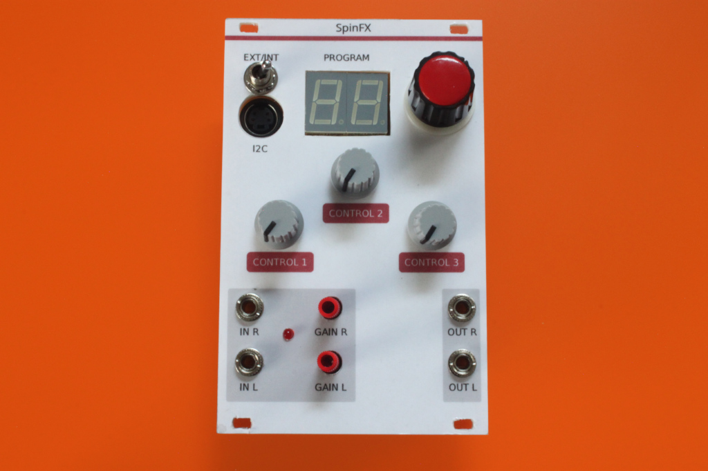

Eurorack SpinFX
===============

An effects module based on the [Spin FV-1](http://www.spinsemi.com/products.html) IC.

The circuit is built from the reference design in the 
[data sheet](http://www.spinsemi.com/Products/datasheets/spn1001/FV-1.pdf) with some 
standard input and output signal level translation. I've also added a slightly over-engineered 
program number display.

More information can be found on the
[project website](http://www.grappendorf.net/projects/eurorack/eurorack-spinfx.html).
